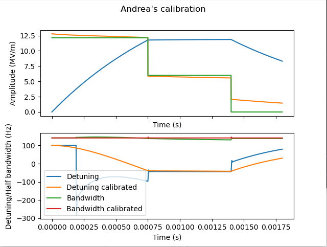

# Scripts to verify the paper 'Calibration of superconducting radio-frequency cavity forward and reflected channels based on stored energy dynamics'

These scripts have the purpouse of checking the correctness of the algorithms contained in the paper [Calibration of superconducting radio-frequency cavity forward and reflected channels based on stored energy dynamics](./Calibration_of_superconducting_radio_frequency_cavity_forward_and_reflected_channels_based_on_stored_energy_dynamics.pdf)

## ! DO NOT DIVULGE !

<u>This repository is for the coauthors of the paper only and other member of MSK involved. Please do not share any part of it!</u>.

## Before starting

Make sure the following packages are installed:

- python3
- numpy
- scipy
- numba
- matplotlib

If you want to regenerate the simulation data, make sure to have *Matlab* with the *Control Toolbox* installed.

## test1

This test verifies if Andrea's implementation of [1] with $k_{add} = 1$ matches Sven's implementation. A simulation provided by Sven is used.

```
$python3 test_ref7_impl.py 
Sim/Sven/Andrea|a: (0.961172366939915+0.169480621402924j) (1.0142641846693388-0.00430700646045213j) (1.0142641846481648-0.004307006462880932j)
Sim/Sven/Andrea|b: (0.026828643449540748-0.15215279784038613j) (-0.0006796421559738808-0.16054671297666406j) (-0.0006796421562902666-0.16054671297412543j)
Sim/Sven/Andrea|c: (0.10350000000000002-0.17926725858337877j) (0.050407771953980385-0.0054784402814582606j) (0.050407771971733906-0.005478440279072266j)
Sim/Sven/Andrea|d: (0.8756551396226443-0.07660989787519153j) (0.9031639238792402-0.06821292562520988j) (0.903163923879569-0.06821292562803344j)


Algorithm diff %|a: 2.001732826857559e-09 normalized to a+c
Algorithm diff %|b: 2.7478023192486076e-10 normalized to b+d
Algorithm diff %|c: 1.6824312022366787e-09 normalized to a+c
Algorithm diff %|d: 3.0532403986812114e-10 normalized to b+d

```

### Regenerate the simulation data

```bash
matlab -nodisplay -nosplash -nodesktop -r "run('FORW_REFL_simulatiom.m');exit;"

```

## test2

This test verifies if Andrea's implementation of [1] with $k_{add} = 2.69595 e^{j\frac{118.7687 \pi}{180}}$ matches Sven's implementation. A simulation provided by Sven is used.

```
$python3 test_ref7_impl.py 
Sim/Sven/Andrea|a: (0.961172366939915+0.169480621402924j) (0.9612717667006472+0.16943848897527955j) (0.9612717666326849+0.16943848895888025j)
Sim/Sven/Andrea|b: (0.026828643449540748-0.15215279784038613j) (0.026822688866061456-0.1521584764043487j) (0.02682268886380107-0.1521584763936195j)
Sim/Sven/Andrea|c: (0.10350000000000002-0.17926725858337877j) (0.10340041917390697-0.17922384170656946j) (0.10340041922175797-0.17922384169415637j)
Sim/Sven/Andrea|d: (0.8756551396226443-0.07660989787519153j) (0.8756612976355934-0.07660125509911903j) (0.875661297637587-0.07660125510572721j)


Algorithm diff %|a: 6.566332903271141e-09 normalized to a+c
Algorithm diff %|b: 1.1777024002389707e-09 normalized to b+d
Algorithm diff %|c: 4.6430011794489485e-09 normalized to a+c
Algorithm diff %|d: 7.413721686890633e-10 normalized to b+d

```

### Regenerate the simulation data

```bash
matlab -nodisplay -nosplash -nodesktop -r "run('FORW_REFL_simulatiom.m');exit;"

```

## test3

This test verifies if Andrea's implementation of the *Energy Constrained* algorithm is capable of finding the calibration coefficients. A simulation provided by Sven is used.

```
$python test_energy_constr_impl.py 
Sim/Sven/Andrea-energy based constr.|a: (0.961172366939915+0.169480621402924j) (0.9612717667006472+0.16943848897527955j) (0.9612004162355136+0.16947032954577948j)
Sim/Sven/Andrea-energy based constr.|b: (0.026828643449540748-0.15215279784038613j) (0.026822688866061456-0.1521584764043487j) (0.026806145794452247-0.1521558477808717j)
Sim/Sven/Andrea-energy based constr.|c: (0.10350000000000002-0.17926725858337877j) (0.10340041917390697-0.17922384170656946j) (0.10347335954628495-0.17925712113909434j)
Sim/Sven/Andrea-energy based constr.|d: (0.8756551396226443-0.07660989787519153j) (0.8756612976355934-0.07660125509911903j) (0.875679432326949-0.07660722043499639j)


Andrea's algorithm diff wrt. ground%|a: 0.0028061757273068646 normalized to a+c
Andrea's algorithm diff wrt. ground%|b: 0.002438540961774042 normalized to b+d
Andrea's algorithm diff wrt. ground%|c: 0.0026771482692304646 normalized to a+c
Andrea's algorithm diff wrt. ground%|d: 0.0026250403247762674 normalized to b+d


Sven's algorithm diff wrt. ground%|a: 0.010139820472487815 normalized to a+c
Sven's algorithm diff wrt. ground%|b: 0.0008837769166900511 normalized to b+d
Sven's algorithm diff wrt. ground%|c: 0.010203092227919689 normalized to a+c
Sven's algorithm diff wrt. ground%|d: 0.0011398388746484249 normalized to b+d
```




### Regenerate the datafile

```shell
  matlab -nodisplay -nosplash -nodesktop -r "run('FORW_REFL_simulation.m'); exit;"

```

---

[\[1\] Pfeiffer, Sven, et al. "Virtual cavity probe generation using calibrated forward and reflected signals." MOPWA040, These Proceedings, IPAC 15 \(2015\).](https://accelconf.web.cern.ch/IPAC2015/papers/mopwa040.pdf)

